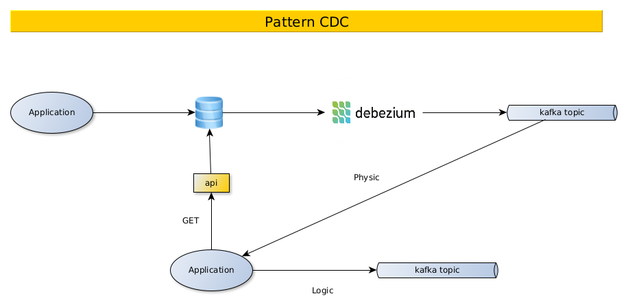

# README

## Schéma



## Démarrage platforme

Postgres doit démarrer en mode spécifique avec l'ajout d'un plugin **wal2json**

* https://github.com/eulerto/wal2json

### Extrait docker-compose.yml

```yaml
  postgres:
    build:
      context: postgres
      dockerfile: Dockerfile
    container_name: postgres
    ports:
      - 5432:5432
    environment:
      - POSTGRES_USER=postgres
      - POSTGRES_PASSWORD=postgres
      - POSTGRES_HOST_AUTH_METHOD=trust
    command:
      - "postgres"
      - "-c"
      - "wal_level=logical"  # Pour debezium
```      

### Extrait postgres/Dockerfile

```Dockerfile
FROM postgres:14

RUN apt-get update &&  apt-get -y install postgresql-14-wal2json
```


### Démarrage

```bash
cd debezium
./start-demo.sh
```


## Paramétrage Debezium

### Création du connecteur 

```bash
# Create connector
cd debezium/demo
curl -i -X POST -H "Accept:application/json" -H "Content-Type:application/json" localhost:9090/connectors/ -d @pg-source-config.json
```

### Fichier de conf "pg-source-config.json" pour la création d'un connecteur

```json
{
    "name": "pg-demo-source",
    "config": {
        "connector.class": "io.debezium.connector.postgresql.PostgresConnector",
        "database.hostname": "postgres",
        "database.port": "5432",
        "database.user": "postgres",    
        "database.password": "postgres",
        "database.dbname": "demo",
        "database.server.name": "postgres-local",
        "plugin.name": "wal2json",
        "table.include.list": "public.credit_cards,public.users",
        "value.converter": "org.apache.kafka.connect.json.JsonConverter"
    }
}
```

## Lancement des tests

```bash
cd gorm
go run main.go
```

## Consultation des topics

```bash
open http://localhost:8080
```


## References


* https://medium.com/geekculture/listen-to-database-changes-with-apache-kafka-35440a3344f0
